# Software Studio 2023 Spring Assignment 2

### Scoring

|  **Basic Component**  | **Score** | **Check** |
| :-------------------: | :-------: | :-------: |
| Membership Mechanism  |    10%    |     Y     |
| Complete Game Process |    5%     |     Y     |
|      Basic Rules      |    45%    |     Y     |
|      Animations       |    10%    |     Y     |
|     Sound Effects     |    10%    |     Y     |
|          UI           |    10%    |     Y     |

|           **Advanced Component**            | **Score** | **Check** |
| :-----------------------------------------: | :-------: | :-------: |
|                Leader board                 |    5%     |     Y     |
|          Offline multi-player game          |    5%     |     Y     |
|          Online multi-player game           |    15%    |     N     |
|                Eatable Coin                 |   1-15%   |     Y     |
|               Continuous jump               |   1-15%   |     Y     |
|              3 types of enemy               |   1-15%   |     Y     |
|                Heal mushroom                |   1-15%   |     Y     |
|           Hidden path for stage 2           |   1-15%   |     Y     |
|            Multi-depth box logic            |   1-15%   |     Y     |
|    Customized number of offline players     |   1-15%   |     Y     |
|              Player name label              |   1-15%   |     Y     |
| Mario invincible state when reborn/got hurt |   1-15%   |     Y     |
|                 Pause game                  |   1-15%   |     Y     |
|                Restart game                 |   1-15%   |     Y     |
|               Volume control                |   1-15%   |     Y     |

---

## Basic Components Description : 

### World map

地圖有二，皆有下列物件與一定程度的美術設計。

* 玩家 (Mario): 瑪利歐，於單人模式下有一位，離線多人至多可有四位
  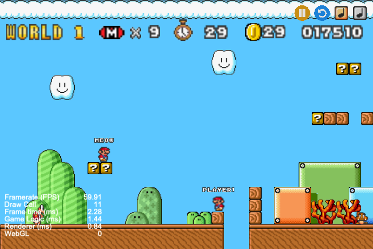
* 前後景: 雲海、小雲、草叢、珊瑚、小山丘、黑幕、不同外觀的地面等
* 固定物件: 地面、遊戲邊界 (不可見)、木磚、三種未知磚 (Question Box/Block)、大木盒、花筒
* 固定特殊物件
  * 通關旗幟
    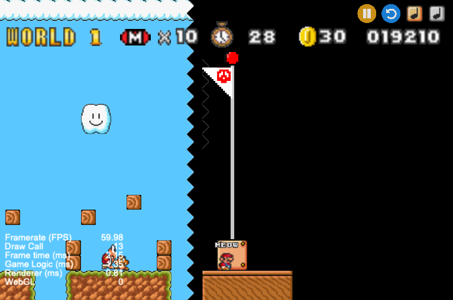
  * 金幣
    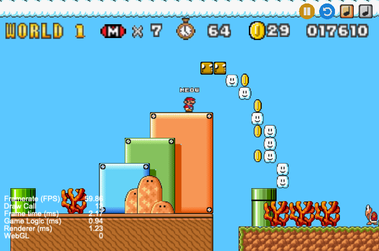
  * 具深度的盒子，橘、藍、綠三色皆然
    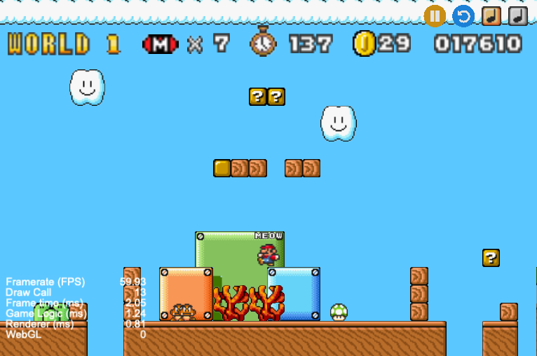
  * (Stage 2) 隱藏通道
    
* 敵人
  * Goomba
  * Turtle
  * Flower

由於 Stage 2 (第二關) 應較 Stage 1 (第一關) 難，故第二關地圖較長，機關也較多，進一步提升美術和遊戲性。以下針對美術與遊戲性的部分列舉說明。

* 木磚人形排列
  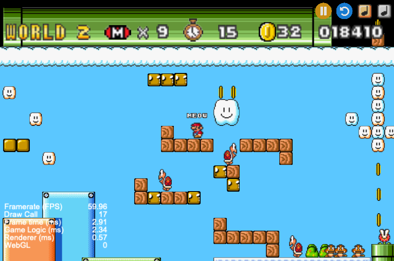
* 隱藏通道相關
  * 前景提示其存在 (見上圖右方)
  * 前景引導玩家中陷阱 (搭配攝影機的性質)
  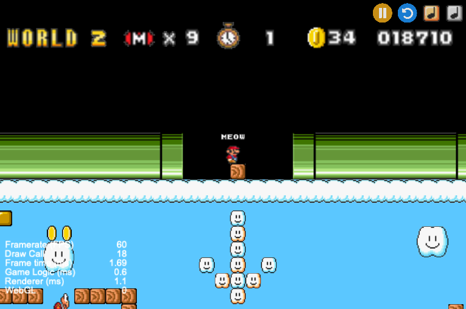
* 敵人池
  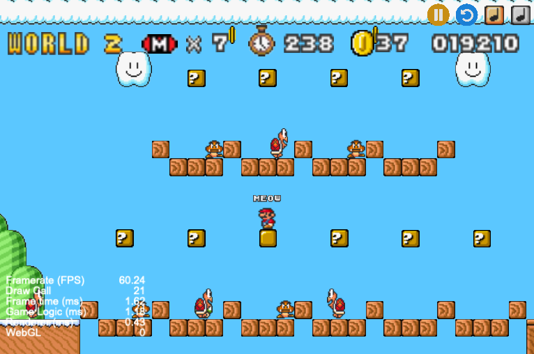
* 天降神兵
  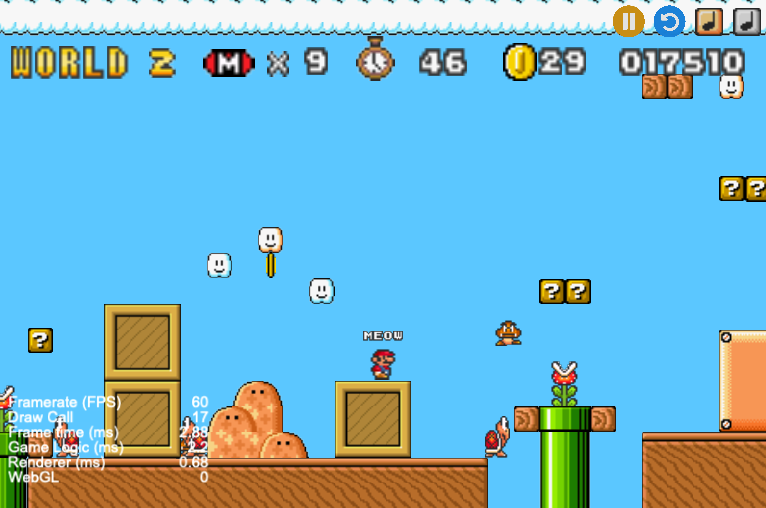
  這有點難截圖，圖中靠近花的一個 goomba 和 turtle 是從天而降的。
  
### Player

目前實作離線單人與多人，多人定義為 1 ~ 4 人，可於階段選擇時設定。

四位玩家中，除了主玩家 (登入帳號的那位) 外，其他皆命名為 `PlayerX`，X 為從 1 開始的編號。原則上與登入帳號之 Firebase 同步，這有利於擴展為多人連線遊戲。

四位玩家操控按鍵列述如下 (左、上、右、focus)，盡量讓四位玩家的手不會打架的情況下易於點按。

Focus 目的是讓攝影機跟隨某位瑪利歐，預設跟隨登入帳號者。

* 主玩家: `AWDS`
* player 1: `GYJH`
* player 2: `LP":`
* player 3: `LEFT UP RIGHT DOWN`

這些玩家將共用生命、時間、金幣數與分數，且只有當所有玩家都抵達終點才算獲勝，這樣對 Ranking 比較公平，讓多人離線不要過於佔優。也由於以支援多人連線為目標，加上為了讓瑪利歐玩起來更流暢，所以對部分邏輯做調整，列述如下:

* 顯示玩家名稱於瑪利歐頭頂
* 單一一位瑪利歐 Power up/down 停止畫面，不然會降低其他玩家的遊戲體驗
* 死亡時不會停止並切換畫面，而是運鏡至玩家重生處
* 支援長按連跳，也就是可以一直按著向上鍵，不斷地上下跳
* 支援牛頓第二運動定律的左右移動，會越走越快，直到瑪利歐速度上限
* 支援瑪利歐跑步煞車動畫 (逆向高速)，與掉頭 (逆向低速)、行走 (順向) 動畫一同實現流暢轉身動畫
* 支援重生、Power up 後受敵人攻擊時的暫時 (2 秒) 無敵效果 (含閃爍動畫)，敵人觸碰無敵狀態下的瑪利歐不會死亡，不過會受瑪利歐的踩踏攻擊
* 單人模式下死亡會重置時間，多人下死亡則不會。

### Enemies

敵人有三，特色列敘如下。

* Goomba
  * 平時左右定速移動，遇障礙物時掉頭 (行走動畫)
  * 橫向觸碰玩家時玩家受傷
  * 受玩家踩踏攻擊時死亡，會加分 (死亡動畫)
* Turtle
  * 平時左右定速移動，遇障礙物時掉頭 (行走動畫)
  * 橫向觸碰玩家時玩家受傷
  * 受玩家踩踏攻擊時縮進龜殼，會加分 (龜縮動畫)
  * 再次受玩家踩踏、觸碰時，根據碰撞方向推動龜殼，會加分 (龜殼移動、旋轉動畫)
  * 旋轉中的龜殼
    * 受玩家踩踏可改變其方向，會與障礙物互動
    * 將橫掃所有橫向觸碰的玩家與敵人
      * 碰到玩家相當於受傷
      * 碰到敵人將擊落並得分
* Flower
  * 花筒本身為障礙物，從中食人花會間歇地出現
  * 觸碰到玩家即讓玩家受傷

### Question Blocks

Question Block/Box 有三種，透過玩家向上敲擊產生物件，會得分、播放被敲擊動畫與音效。產生的物件列敘如下。

* 金幣
* 升級蘑菇
  * 玩家向上敲擊後向上產生紅蘑菇，產生動畫播出時不會被吃掉
  * 隨後向左移動，此時受物理引擎左右，與玩家和敵人不會發生物理效果
  * 玩家觸碰後變大 (貼圖與剛體皆然，含動畫與音效)，紅蘑菇消失並加分
  * 蘑菇走出邊界即消失
* 回血蘑菇
  * 玩家向上敲擊後向上產生綠蘑菇，產生動畫播出時不會被吃掉
  * 隨後向左移動，此時受物理引擎左右，與玩家和敵人不會發生物理效果
  * 玩家觸碰後玩家共用之血量增加一，綠蘑菇消失並加分
  * 蘑菇走出邊界即消失

### Animations

####  Mario

玩家基本上有五個動畫。

* 閒置
* 移動
* 跳躍
* 煞車
* 轉身

又由於分 power up 與否兩種，故有十個動畫。外加下列主要由腳本實現之動畫:

* 死亡動畫
* Power up 動畫
* Power down 動畫
* 無敵狀態動畫

共 14 個。

#### 敵人

* Goomba
  * 左右移動
  * 死亡
* Turtle
  * 左右移動
  * 龜縮
  * 龜縮旋轉
* Flower
  * 上下移動

#### 其他

* 金幣旋轉動畫
* Question Box 問號跑馬燈動畫
* 蘑菇生成動畫

### Sound effects

#### BGM

* 主選單、登入、註冊畫面、關卡選擇等使用 `bgm_1`
* 關卡一使用 `bgm_2`
* 關卡二使用 `bgm_2`

#### 瑪利歐本身

* 跳躍
* 踩敵人的踢擊
* Power up
* Power down
* 失去一條命

#### 關卡音效

* 吃金幣
* 生成蘑菇
* 通關

### UI

畫面切換流程為

* Menu
  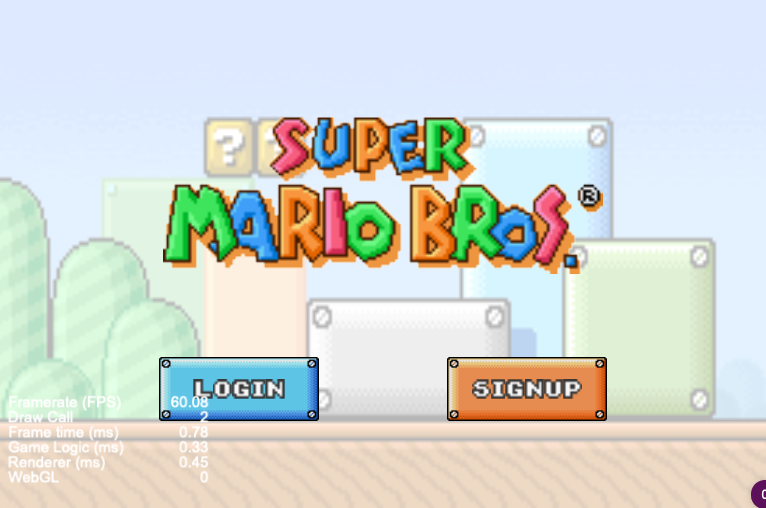
* -> Login/Sign up
  |login|sign up|
  |:-:|:-:|
  |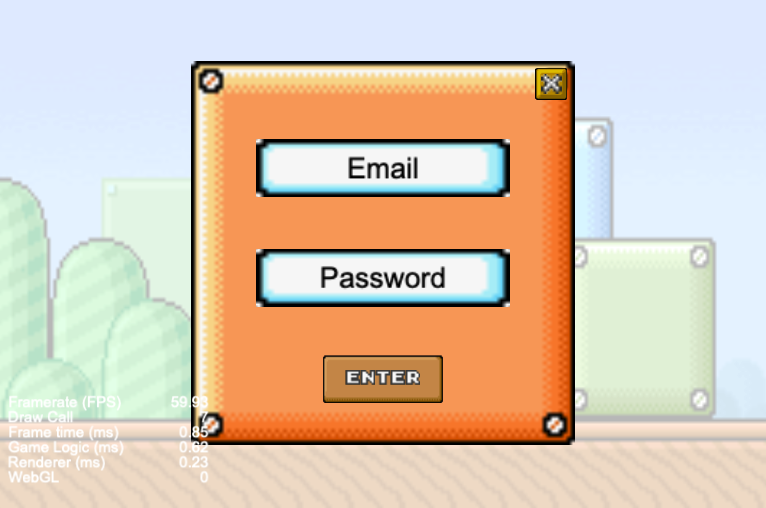||
* -> 關卡選擇
  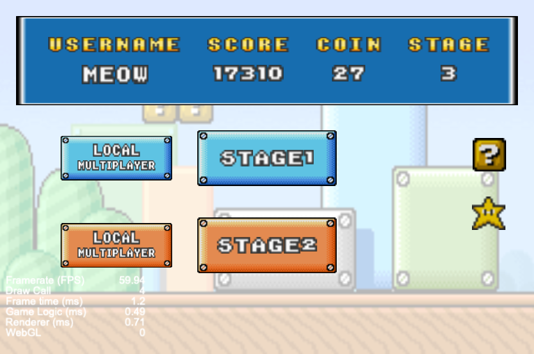
* -> 關卡起始畫面
  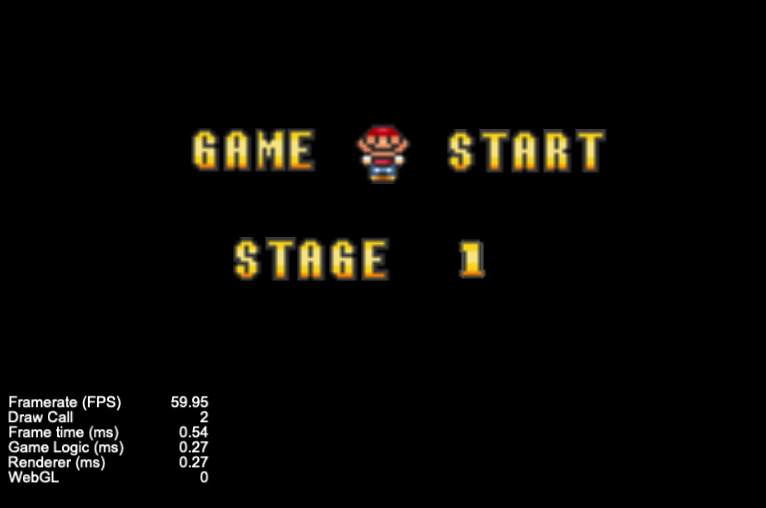
* -> 關卡 (圖略)
* -> 勝利/失敗換畫面
  |win|game over|
  |:-:|:-:|
  |||
* -> 關卡選擇 (圖略)

當中 Menu 選擇 Login/Sign up 後可透過關閉按鈕切回 Menu。

在關卡選擇中可預覽當前玩家的名稱、生命、金幣和最高分數。另可點擊 Question Box 查看玩法、星型按鈕查看 leader board。

|查看玩法|Leader board|
|:-:|:-:|
|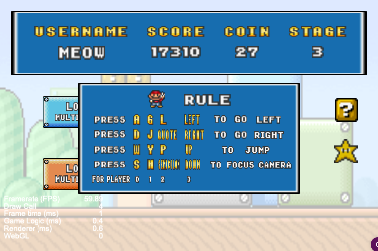||

兩關卡主按鈕左方分別有個副按鈕，為離線多人模式的進入點。

進入遊戲畫面後，UI 會顯示玩家所處的關卡、生命、剩餘時間、金幣和當前分數。

## Advanced Component Description

### Leader board

Leader board 如 UI 中所述，以星型按鈕查看 leader board。當中對每個玩家只會紀錄最高分，由上而下排序，共顯示五名。

### Offline Multi-player game

前面描述過離線多人的功能，這裡僅簡單摘要。

* 1 ~ 4 人，共享生命、金幣、剩餘時間、分數。
* 除登入之主玩家的瑪莉歐頭上有註冊時的名稱外，其餘玩家以 `player` 搭配流水號命名
* 所有人都到終點才算勝利
* 攝影機只會追蹤一位玩家，增加遊戲難度並降低多人分數優勢
* 某玩家 power up/down 或死亡不會停頓或轉移至載入畫面，而是繼續進行，增加其他玩家的遊戲體驗

### Eatable coin

兩關都有可以直接吃的金幣，有音效與動畫。

### Continuous jump

所有瑪利歐都可以連續跳，也就是長按跳躍鍵可不斷嘗試跳躍。

### 3 types of enemy

有 Goomba、Turtle 和 Flower 三種敵人。

### Heal mushroom

Question Box 有三種，除金幣和 power up 的蘑菇外，多一個回血蘑菇。

### Hidden path for stage 2

第二關有隱藏通道，幫助玩家度過困難區域，還有騙玩家離開隱藏通道的美術設計。

### Multi-depth box logic

兩關都實作有縱深的箱子 (紅、綠、藍色箱)。

### Customized number of offline players

多人離線模式可指定 1 ~ 4 為不定數的玩家。

> 其實可以再更多，不過鍵盤按鍵對更多玩家不友善。

### Player name label

玩家名稱顯示在玩家頭上，不會跟其他瑪利歐搞混。

### Mario invincible state when reborn/got hurt

瑪利歐受傷或重生時會進入兩秒的無敵模式，免得一死再死，或者重生時直接撞到敵人的尷尬情境。

### Pause Game

右上角暫停按鈕可已暫停遊戲，再按一次可以繼續。

### Restart Game

右上角重置按鈕可已重新玩遊戲 (若為多人模式依然以多人模式重新開始)。

### Volume control

右上角橘色音樂按鈕可增加音量，右上角白色音樂按鈕可降低音量。

# Firebase page link

[https://ss-assignment2-mario.web.app/](https://ss-assignment2-mario.web.app/)